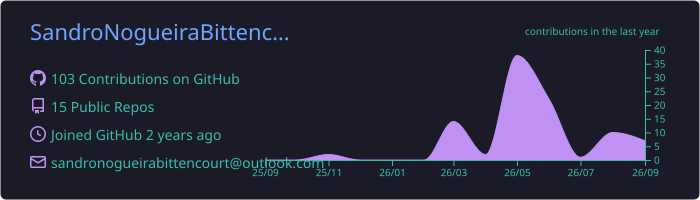
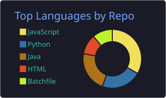
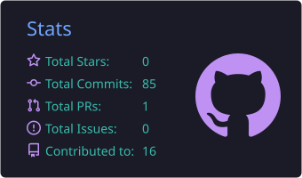
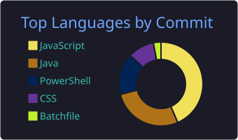
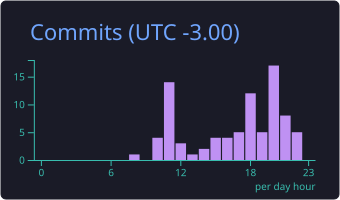

# 👨‍💻 Sandro Nogueira

**Desenvolvedor Full Stack | Especialista em Segurança da Informação | Red Team**

Olá! Me chamo **Sandro Nogueira**.

Tenho mais de **12 anos de experiência em Tecnologia da Informação**, atuando em diferentes áreas como:

- Desenvolvimento de software
- Infraestrutura e suporte
- Segurança da informação
- Consultoria em TI

Atualmente trabalho como **Analista de TI, Desenvolvedor e Especialista em Segurança**, com **10 anos de experiência em consultoria tecnológica**.

Neste momento estou direcionando minha carreira para **Segurança Ofensiva (Red Team)**, focando em:

- Pentest
- Análise de vulnerabilidades
- Hardening de sistemas
- Automação de segurança
- Desenvolvimento de ferramentas

Aqui você encontrará alguns dos projetos que desenvolvi ao longo da minha jornada.

---

## 📊 Estatísticas do GitHub

  

  
  

  
  

  

---
## 🚀 Tecnologias e Ferramentas

---
## 🦹 Commits
<!-- Pacman -->
<picture>
  <source media="(prefers-color-scheme: dark)" srcset="https://raw.githubusercontent.com/SandroNogueiraBittencourt/SandroNogueiraBittencourt/output/pacman-contribution-graph-dark.svg">
  <source media="(prefers-color-scheme: light)" srcset="https://raw.githubusercontent.com/SandroNogueiraBittencourt/SandroNogueiraBittencourt/output/pacman-contribution-graph.svg">
  
</picture>

## 📌 Áreas de Interesse

🔐 Segurança Ofensiva  
🛠 Pentest e Red Team  
🐍 Automação com Python  
⚙️ Ferramentas de Segurança  
🌐 Desenvolvimento Web  
🐧 Linux e Hardening

---

## 📫 Contato

📧 Email: sandronogueirabittencourt@outlook.com

💼 GitHub: https://github.com/SandroNogueiraBittencourt
